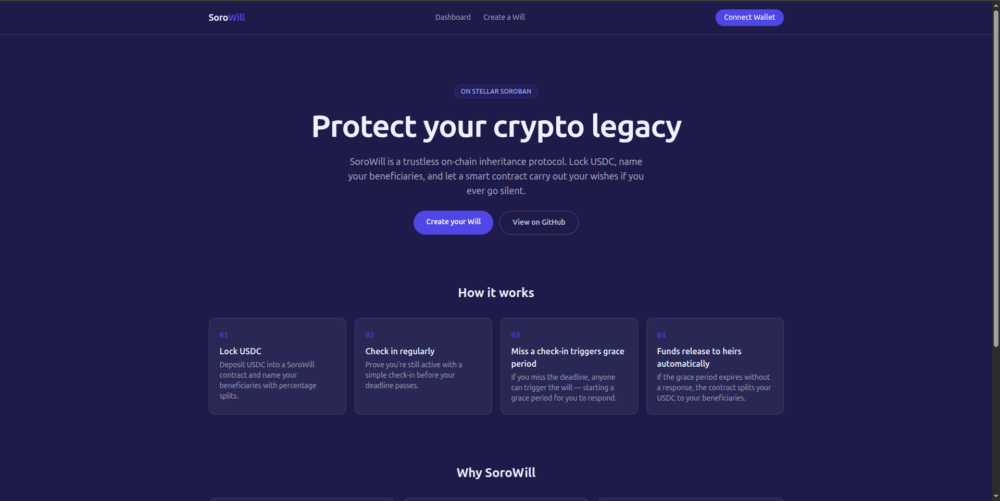

# SoroWill App

**On-chain inheritance, in your browser**

[](https://nextjs.org/)
[](https://www.typescriptlang.org/)
[](https://tailwindcss.com/)
[](https://developers.stellar.org/)
[](./LICENSE)

**Live app: [sorowill.vercel.app](https://sorowill.vercel.app/)**



## What is SoroWill

SoroWill is a trustless, on-chain inheritance protocol on Stellar Soroban. This app is the dashboard for it: create a will, check in to prove you're active, review beneficiaries and guardians, and — for anyone named as a beneficiary — verify and claim an inheritance once a will's grace period has elapsed.

## Tech Stack

- **Next.js 14** (App Router)
- **TypeScript** (strict mode)
- **Tailwind CSS 3**
- **[@sorowill/sdk](../sorowill-sdk)** for all contract interaction and Freighter wallet handling

> **Wallet support:** This app currently only supports the **[Freighter](https://freighter.app/)** browser extension. Other Stellar wallets (Albedo, xBull, Rabet, …) are not yet supported — you will not be able to connect them. Multi-wallet support is tracked in the SDK's wallet-adapter work; see the [`@sorowill/sdk`](https://www.npmjs.com/package/@sorowill/sdk) package for progress.

## Local Setup

```bash
git clone https://github.com/SoroWill/sorowill-app.git
cd sorowill-app
# The .nvmrc file pins Node 20 (matching CI). If you use nvm/fnm/volta, run:
#   nvm use       (nvm)
#   fnm use        (fnm)
#   volta install  (volta)
npm install
cp .env.example .env.local
# fill in NEXT_PUBLIC_CONTRACT_ID with your deployed SoroWill contract address
npm run dev
```

> This app depends on [`@sorowill/sdk`](https://www.npmjs.com/package/@sorowill/sdk), published to npm under the `sorowill` org.

## Environment Variables

| Variable | Description |
|---|---|
| `NEXT_PUBLIC_STELLAR_NETWORK` | Stellar network to connect to: `testnet` or `mainnet` |
| `NEXT_PUBLIC_CONTRACT_ID` | Address of the deployed SoroWill contract |
| `NEXT_PUBLIC_RPC_URL` | Soroban RPC endpoint (defaults to the public testnet RPC) |
| `RESEND_API_KEY` | API key for reminder emails (optional; leave unset to skip sending) |
| `RESEND_FROM_EMAIL` | Verified Resend sender address used for reminder emails |
| `KV_REST_API_URL` | Vercel KV / Upstash Redis REST URL used to persist reminder subscriptions (required for reminders; the serverless filesystem is ephemeral) |
| `KV_REST_API_TOKEN` | REST token for the KV store above |
| `REMINDER_STORE_KV_KEY` | Optional key used to store the reminder blob in the KV store (defaults to `sorowill:reminder-store`) |
| `NEXT_PUBLIC_APP_URL` | Optional public base URL used to build the unsubscribe link in reminder emails (defaults to `VERCEL_URL` or `http://localhost:3000`) |

## Pages

| Route | Description |
|---|---|
| `/` | Landing page explaining SoroWill |
| `/dashboard` | Your wills (owned and inherited), with quick check-in |
| `/will/new` | Multi-step form to create a new will |
| `/will/[id]` | Full will detail: check in, top up, update beneficiaries, cancel, trigger, release |
| `/inherit/[id]` | Beneficiary view — see your entitled share and claim once ready |
| `/verify/[id]` | Public, wallet-free verification of a will's on-chain state |

## Reminder delivery

Reminders are delivered by a server-side route that can be triggered on a schedule. The app ships a lightweight JSON store for subscriptions and dispatch history, so a daily cron job or Vercel Cron can call the dispatch endpoint without exposing any secrets:

```bash
curl -X POST https://your-app.example.com/api/reminders/dispatch
```

The dispatch route computes reminder windows from each will's `lastCheckin` and `checkinPeriodDays`, sending a well-before reminder once and an imminent reminder once for each active will that still has time left. The route is protected by a `CRON_SECRET` bearer token when configured, and Vercel cron plus GitHub Actions can both invoke it.

## Contributing via Drips Wave

This repo participates in the **Stellar Wave Program** on [Drips](https://drips.network/wave). Maintainer-tagged issues carry Point values, and contributors who resolve them during an active Wave earn a proportional share of that Wave's reward pool. See [CONTRIBUTING.md](./CONTRIBUTING.md) for the contribution workflow, and <https://drips.network/wave> for how Wave itself works.
